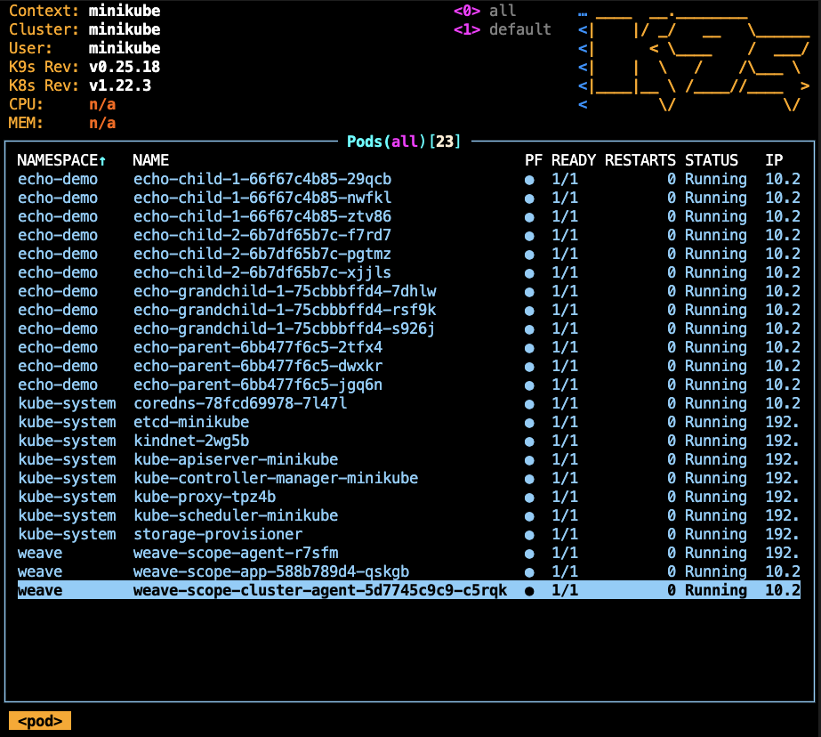
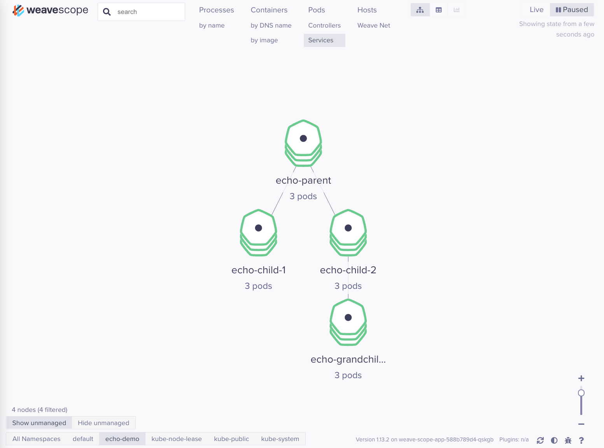

## Overview

This is a simple demonstration of how Tilt works.

## Prerequisite installations

- minikube - `brew install minikube`
- ctlptl - `brew install tilt-dev/tap/ctlptl`
- tilt - `brew install tilt`

### Optional

- k9s - `brew install derailed/k9s/k9s`

## Running demo

_Minikube should be off and there should be no cluster created or kubeconfig. Run `minikube delete` if there's a cluster present._

1. `ctlptl create cluster minikube --registry=ctlptl-registry --kubernetes-version=v1.22.3`
1. `tilt up` -> press space to open in browser
1. _Optional in a separate terminal_ `k9s`
1. `curl localhost:3333/echo-child-1` -> `Response from echo-child-1`
1. `curl localhost:3333/echo-child-2` ->

```
Response from echo-child-2
Response from echo-grandchild-1%`
```

## Viewing cluster with Weave Scope

_Instructions taken from [here](https://www.weave.works/docs/scope/latest/installing/#k8s)

1. `kubectl apply -f "https://cloud.weave.works/k8s/scope.yaml?k8s-version=$(kubectl version | base64 | tr -d '\n')"`
1. `kubectl port-forward -n weave "$(kubectl get -n weave pod --selector=weave-scope-component=app -o jsonpath='{.items..metadata.name}')" 4040`
1. Open [http://localhost:4040](http://localhost:4040)

## What you should see

**Run the curl commands a few times each to make the traffic connections show up. You may also want to filter Weave Scope by namespace (buttons on the bottom)**


